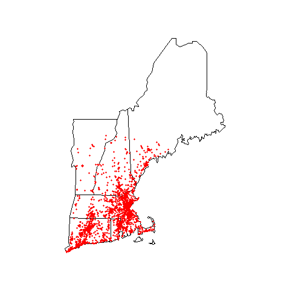

## Background 

Dunkin Donuts is a very popular coffee shop from Massachusetts. It is very popluar in the New England region of the United States. Given the schedule many college students have it seems reasonable that they will be drinking a lot of coffee, possibly from a Dunkin Donuts. 

This is just a simple report on some of the basic sample statistics for Dunkin Donuts in the New Englad Region. It's goal is not to be of publishable quality but to display some data scraping skills and using a make file for students. 


## The Data

This data was obtained by web scraping. More detailed information can be found  here: [Data Download](data_download.html). The zip code file used to determine the data was:

```
zip <- c(02903 )
```

Our function also allows us to enter in information on number of matches and radius. These will be left to the defaults, which are the maximum that mapquest allows for. 

## The Map

Below is a representation of the location of all the Dunkin Donuts in the New England Region:




## Basic Information

The table below displays the number of Dunkin Donuts per state in New England.

```{r, echo=FALSE}
load("data/Dunkin.Rda")
table <- as.data.frame(table(data_dd$state))
names(table) <-c("State", "Count")
knitr::kable(table)
```

